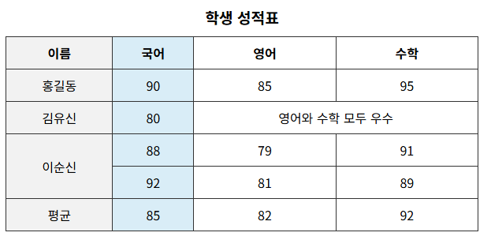
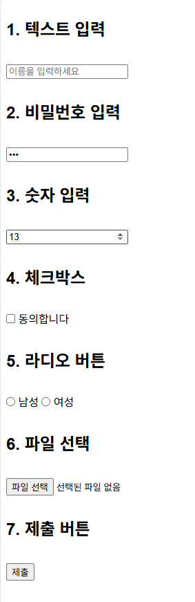

## HTML

### 링크의 상대 주소

현재 폴더 : 점 한개 (./) <br />
상위 폴더 : 점 두개 (../) <br />
최상위 폴더 : 슬래시 (/) <br />
특별히, index.html 파일은 이름을 생략하고 폴더 이름만 쓸 수 있음. 예를 들어, pages 폴더안에 index.html 이 있을 때, http://example.com/pages/로 접속하면 자동으로 pages/index.html을 보여줌.

### URI 프래그먼트

: URL 끝에 붙는 #아이디 형태의 값. 이걸 사용하면 HTML 문서 내에서 특정 요소로 바로 이동할 수 있음

#### 사용 방법

1. HTML 문서 내에서 이동하고 싶은 대상에 id 속성을 지정해준다
2. 링크를 만들 때 href = "id값" 으로 작성한다
3. 브라우저는 해당 id를 가진 요소로 자동 스크롤해준다

ex.

```html
<body>
  <h2 id="intro">소개</h2>
  <p>이곳은 사이트 소개 부분입니다.</p>

  <h2 id="contact">연락처</h2>
  <p>이메일은 hello@example.com입니다.</p>
</body>
```

```html
<!-- 링크 -->
<ul>
  <li><a href="#intro">소개로 이동</a></li>
  <li><a href="#contact">연락처로 이동</a></li>
</ul>
```

-> 링크를 클릭하면 브라우저가 자동으로 해당 id가 있는 위치로 스크롤을 이동시켜줌 <br />
-> 페이지 리로드 없이 작동하는 것도 특징 !

💡 외부 문서로도 가능하다

```html
<a href="about.html#team">우리 팀 보기</a>
```

-> about.html 페이지로 이동 후, 그 안에 있는 id = "team" 요소로 자동이동.

### 주요 태그 & 기능 정리

#### 링크

- 새 창으로 열기 : target = "\_blank"

ex.

```html
<a href="https://movie.naver.com" target="_blank"> 네이버 영화 </a>
```

- 현재 창으로 열기 : target = "\_self"

ex.

```html
<a href="https://movie.naver.com" target="_self"> 네이버 영화 </a>
```

#### 텍스트 표현

- 줄바꿈 : &lt;br&gt;
- 취소 : &lt;s&gt;
- 인용 : &lt;blockquote&gt;
- 짧은인용 : &lt;q&gt;
- 위첨자 : &lt;sup&gt;
- 아래첨자 : &lt;sub&gt;
- HTML에 적혀있는거 그대로 : &lt;pre&gt;

### 리스트

1. 순서있는 리스트 : &lt;ol&gt;&lt;li&gt;&lt;/li&gt;&lt;/ol&gt; <br />

   ol의 type 속성으로 기호를 바꿀 수 있다. (type = 'A' , type = 'a' , type = '1' (기본값) , type = 'i' 등)

2. 순서없는 리스트 : &lt;ul&gt;&lt;li&gt;&lt;/li&gt;&lt;/ul&gt; <br />

   보통 list-style : none; 을 준다 (기호 안 보이게)

### 테이블

- &lt;table&gt; &lt;thead&gt; &lt;tbody&gt; &lt;tfoot&gt; 순. 테이블, 머리글, 본문, 바닥글 순.
- &lt;tr&gt; 로 행을 생성하고, &lt;td&gt;로 셀을 생성한다. &lt;th&gt;는 셀의 제목이다.
- 셀을 가로로 합칠 때 ? : colspan <br />
  ex.

```html
<td colspan="2">세번째 셀</td>
// 2개의 열을 합침
```

- 셀을 세로로 합칠 때 : rowspan
  ex.

```html
<td rowspan="2">세번째 셀</td>
```

- caption : 표에 제목을 붙힐 때

- colgroup : th 또는 td에 적용할 스타일을 해당 태그에서 미리 설정할 수 있도록 함

#### 테이블 예시

```html
<table>
  <caption>
    학생 성적표
  </caption>

  <colgroup>
    <col span="1" />
    <col span="1" />
    <col span="1" />
    <col span="1" />
  </colgroup>

  <thead>
    <tr>
      <th>이름</th>
      <th>국어</th>
      <th>영어</th>
      <th>수학</th>
    </tr>
  </thead>

  <tbody>
    <tr>
      <td>홍길동</td>
      <td>90</td>
      <td>85</td>
      <td>95</td>
    </tr>
    <tr>
      <td>김유신</td>
      <td>80</td>
      <td colspan="2">영어와 수학 모두 우수</td>
    </tr>
    <tr>
      <td rowspan="2">이순신</td>
      <td>88</td>
      <td>79</td>
      <td>91</td>
    </tr>
    <tr>
      <td>92</td>
      <td>81</td>
      <td>89</td>
    </tr>
  </tbody>

  <tfoot>
    <tr>
      <td>평균</td>
      <td>85</td>
      <td>82</td>
      <td>92</td>
    </tr>
  </tfoot>
</table>
```

결과



### 폼

- action 속성 : 폼 내용을 전송할 주소를 정함.

  ex.

```html
<form action="https~~"></form>
```

- method 속성 : 리퀘스트 보낼 때 쓴다. 기본속성은 get

  ex.

```html
<form method="post"></form>
```

- &lt;form&gt;에 &lt;label&gt; &lt;input&gt; &lt;button&gt;이 들어가는데, label의 for 속성과 input의 id 속성을 연결해서 사용해주는게 ux적으로 좋다. (label을 클릭해도 input에 포커싱이 된다.) <br />
  (어떤 라벨이 어떤 필드에 해당하는지 알려주고, 자동포커스. 각 필드의 목적을 더 쉽게 알 수 있다) <br />
  자동 포커스는 &lt;label&gt; 태그로 &lt;input&gt;을 감싸면 포커싱 되긴 함. 하지만 접근성 좋은 웹사이트를 위해선 label의 for속성과 input의 id속성을 연결해주는게 권장되고 있다.

ex.

```html
<label for="username">아이디</label>
<input id="username" name="..." />

OR

<label>
  아이디
  <input name="..." />
</label>
```

- input에는 다양한 type이 있음

checkbox 예시.

```html
<label>
  <input type="checkbox" name="film" value="action" />
  액션
</label>
```

-> 이렇게하고 폼을 전송하면, &film=action .. 이렇게 전송된다.

- hidden 타입 <br />
  사용자에게 보이지 않는 값을 숨겨서 전송할 때 사용함

```html
<input type="hidden" name="userId" value="12345" />
```

언제사용 ? -> 사용자가 입력할 필요 없고, 몰라도 되는 정보이지만 폼 전송과 같이 전송해주어야 하는 정보를 담아서 보낼 때. <br />
또는 사용자가 변경해서는 안되는 데이터를 함께 보낼 때

그 외 다양한 type들

1. 'date' (날짜)
2. 'file' (파일) : accept로 허용할 파일 확장자들을 정해 줄 수 있다. 또한, multiple 속성을 사용하면 여러 개 가능. <br />
   ex.

```html
<input type="file" accept=".jpg, .png" multiple />
```

3. 'email' (이메일) : 올바른 이메일 형식인지 자동으로 검사
4. 'number' (숫자) : min, max로 최소, 최대값 지정할 수 있고, step으로 증감양을 정할 수 있다. <br />
   ex.

```html
<input type="number" min="100" max="1000" step="100" />
```

5. 'password' : 입력한 값을 숨겨준다
6. 'radio' : 동그란 선택 버튼. 보통 value 속성과 같이 사용한다
   ex.

```html
<input id="bad" name="feeling" value="1" type="radio" />
<label for="bad">나쁨</label>
```

7. 'range' : 범위 안에서 선택할 수 있는 인풋
8. 'text' : 일반적인 텍스트

- &lt;select&gt; 태그 : 옵션 선택

select 태그 안에 &lt;option&gt; 태그를 value와 함께 사용하면 된다

ex.

```html
<label for="genre">장르</label>
<select id="genre" name="genre">
  <option value="korean">한국 영화</option>
  <option value="foreign">외국 영화</option>
  <option value="drama">드라마</option>
  <option value="documentary">다큐멘터리</option>
  <option value="vareity">예능</option>
</select>
```

-> 여기서 드라마를 선택하면 genre값이 drama가 된다.

- 긴글

&lt;textarea&gt;

- 여러 줄 입력 (긴 글 작성 시)
- rows, cols로 크기 지정 가능
- placeholder 지원

```html
<label for="content">내용</label>
<textarea
  id="content"
  name="content"
  rows="4"
  cols="50"
  placeholder="내용을 입력하세요"
></textarea>
```

- placeholder : 비어있는 인풋에 대한 설명. <br/>
  디자인 바꾸려면 ?

  ```css
  input::placeholder {
    color: #dddddd;
  }
  ```

- 폼에서 반드시 입력해야 하는게 있다면 ? :required <br />
  이 인풋값이 비어있으면 전송이 안된다.

  ex.

```html
<input name="email" type="email" required />
```

- 정규표현식으로 입력 형식 제한 ? : pattern

  ex.

```html
<input
  type="text"
  name="userid"
  required
  pattern="[a-z0-9]{5,10}"
  title="영어 소문자와 숫자 5~10자"
/>
```

- 자동완성 : autocomplete = "on" , email, tel값도 쓸 수 있다. <br />
  ex.

```html
<input name="search" type="text" autocomplete="on" />

<label>이메일</label>
<input type="email" name="email" autocomplete="email" />

<label>전화번호</label>
<input type="tel" name="phone" autocomplete="tel" />

<label>비밀번호</label>
<input type="password" name="password" autocomplete="current-password" />
```

- datalist : input에 입력 자동완성 옵션 제공

```html
<label for="browser">브라우저:</label>
<input list="browsers" id="browser" name="browser" />
<datalist id="browsers">
  <option value="Chrome"></option>
  <option value="Firefox"></option>
  <option value="Safari"></option>
  <option value="Edge"></option>
</datalist>
```

이렇게하면, &lt;input&gt; 태그에 연결되어 사용자가 값을 쉽게 입력 할 수 있도록 추천 목록을 제공하고, 타이핑 할 경우 자동완성 되는 기능 제공 <br />

주의할 점은 &lt;input&gt;의 list에 정의된 값과 &lt;datalist&gt;의 id값이 같아야한다. (그래야 연결됨)

### 폼 생긴것좀 보자

```html
<h2>1. 텍스트 입력</h2>
<input type="text" placeholder="이름을 입력하세요" />

<h2>2. 비밀번호 입력</h2>
<input type="password" placeholder="비밀번호" />

<h2>3. 숫자 입력</h2>
<input type="number" placeholder="나이 입력" />

<h2>4. 체크박스</h2>
<label><input type="checkbox" /> 동의합니다</label>

<h2>5. 라디오 버튼</h2>
<label><input type="radio" name="gender" value="male" /> 남성</label>
<label><input type="radio" name="gender" value="female" /> 여성</label>

<h2>6. 파일 선택</h2>
<input type="file" />

<h2>7. 제출 버튼</h2>
<input type="submit" value="제출" />
```



- 외부에 있는 것을 불러올 때 : &lt;link&gt; <br />
  어떤 목적 ? : rel <br />
  위치 ? : href <br />

  ex.

```html
<link rel="stylesheet" href="style.css" />
```

- 자바스크립트 파일을 불러올 때 : &lt;script&gt; 태그 <br />
  ex.

```html
<script src="like.js"></script>
```

- 시맨틱 태그 : 의미가 담겨있는 태그들. 검색 엔진 최적화 (SEO)나 접근성(accessibility)을 높이는데 도움이 된다.

  1. &lt;header&gt; : 영역 위쪽. 로고나 제목, 메뉴를 담고있는 도입부
  2. &lt;main&gt; : 사이트의 본격적인 내용. 페이지에서 딱 한번만 사용가능
  3. &lt;footer&gt; : 영역 아래쪽
  4. &lt;article&gt; : 하나의 완성된, 독립적인 내용을 나타냄
  5. &lt;section&gt; : 어떤것의 일부분
  6. &lt;figure&gt; : 이미지와 이미지 설명을 담고있음
