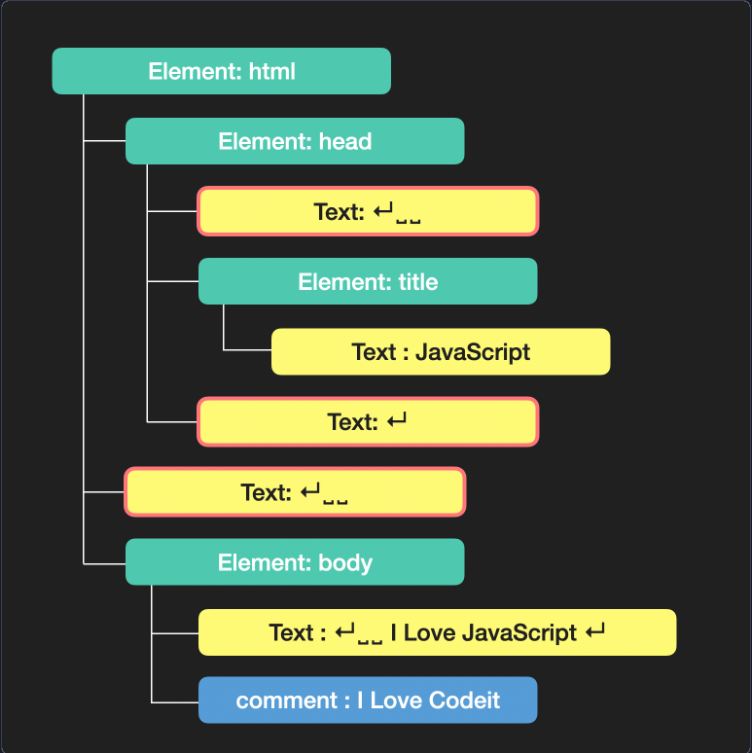

## 인터렉티브 자바스크립트

### 자바스크립트로 태그 선택하기

1. getElementById

- 반환타입 : 단일 Element

```javascript
<div id="myDiv">안녕하세요</div>;
const element = document.getElementById("myDiv");
```

2. getElementsByClassName

- 반환타입 : HTMLCollection

```javascript
<div class="item">항목 3</div>;
const items = document.getElementsByClassName("item");
```

3. getElementsByTagName

- 반환타입 : HTMLCollection

```javascript
const paragraphs = document.getElementsByTagName("p");
```

4. querySelector

- CSS 선택자를 사용하여 첫 번째 일치하는 요소 선택
- 반환타입 : 단일 Element

```javascript
// 첫 번째 .item 클래스를 가진 요소 선택
const firstItem = document.querySelector(".item");
firstItem.style.color = "blue";

// ID로 선택 (# 사용)
const myDiv = document.querySelector("#myDiv");

// 태그 이름으로 선택
const firstParagraph = document.querySelector("p");

// 복잡한 선택자도 사용 가능
const nestedItem = document.querySelector("ul li.special");
```

5. querySelectorAll

- CSS 선택자와 일치하는 모든 요소를 선택
- 반환요소 : NodeList

```javascript
// 모든 .item 클래스를 가진 요소 선택
const allItems = document.querySelectorAll(".item");

// NodeList는 최신 브라우저에서 forEach 메서드를 지원함 !??
allItems.forEach((item) => {
  item.style.margin = "10px";
});

// 여러 선택자 사용 (콤마로 구분)
const headers = document.querySelectorAll("h1, h2, h3");
headers.forEach((header) => {
  header.style.fontFamily = "Arial";
});
```

NodeList는 최신 브라우저에서 forEach 메서드를 지원함의 의미 ? <br />
= NodeList는 배열과 비슷하지만 진짜 배열은 아니라서, 옛날엔 forEach 메소드가 안됐는데, 요즘 최신 브라우저에서는 forEach해도 잘 돌아감.

### HTMLCollection VS NodeList

- HTMLCollection은 DOM이 변경되면 자동으로 업데이트되지만, NodeList는 정적이여서, DOM이 변경되어도 업데이트 되지 않음

### 유사배열

: 이름 그대로 배열과 유사한 객체를 칭함 <br />

특징 <br />

- length 프로퍼티를 가지고 있다.
- 인덱스로 요소에 접근 가능
- 배열의 메서드를 사용할 수 없다. (push, pop, forEach 등)

#### 대표적인 예시

1. DOM 요소

```javascript
// getElementsByClassName은 HTMLCollection(유사배열)을 반환함
const divs = document.getElementsByClassName("my-class");
console.log(divs.length); // 작동함
divs.forEach((div) => console.log(div)); // 오류 발생! forEach는 실제 배열에만 있는 메서드임
```

2. 함수 내부의 arguments 객체

```javascript
// 전달된 모든 숫자를 더하는 함수
function sum() {
  let total = 0;

  // arguments 객체를 순회
  for (let i = 0; i < arguments.length; i++) {
    total += arguments[i];
  }

  return total;
}

console.log(sum(1, 2, 3, 4, 5)); // 15
```

3. 문자열

```javascript
const str = "Hello";
console.log(str.length); // 5
console.log(str[0]); // "H"

// 하지만 배열 메서드는 직접 사용 불가
// str.map() // 오류 발생
// 문자열도 인덱싱과 length가 가능하니까 유사배열처럼 쓸 수는 있지만, 배열은 아니다!
```

4. querySelectorAll 사용 시

```javascript
// querySelectorAll은 NodeList(유사배열)를 반환함
const paragraphs = document.querySelectorAll("p");
console.log(paragraphs.length); // 작동함
// 최신 브라우저에서는 NodeList에 forEach가 구현되어 있지만, 다른 배열 메서드는 없음
```

5. jQuery 객체 사용시

### 이벤트

#### 이벤트

: 웹 페이지에서 발생하는 대부분의 일 (ex. 버튼 클릭, 스크롤, 키보드 입력)

#### 이벤트 핸들링

: 자바스크립트를 통해 이벤트를 다루는 일

#### 이벤트 핸들러

: 이벤트가 발생했을 때 일어나야하는 구체적인 동작들을 표현한 코드. 이벤트 리스너(Event Listener)라고도 부른다.

#### 이벤트 핸들러를 등록하는 2가지 방법

1. 해당 DOM 객체의 onclick 프로퍼티에 등록하기

```javascript
const btn = document.querySelector("#myBtn");

btn.onclick = function () {
  console.log("버튼 눌렸음!");
};
```

2. HTML 태그에 onclick 속성에 바로 표시하기

```javascript
<button id="myBtn" onclick="console.log('버튼 눌렸음!')">
  클릭!
</button>
```

### 브라우저와 자바스크립트

#### Window 객체

: 브라우저 창을 대변하면서 자바스크립트에서 최상단에 존재하는 객체

#### DOM ( Document Object Model )

: 문서 객체 모델. 웹 페이지에 나타나는 HTML 문서 전체를 객체로 표현한 것. 이때 각 객체는 노드라는 용어로 표현하고, 태그는 요소 노드, 문자는 텍스트 노드로 구분됨

노드 상세 -> HTML 문서를 구성하는 모든 개별 구성 요소. 웹페이지의 HTML을 트리 구조로 표현할 때, 그 트리의 각각의 점들.

#### 자바스크립트로 웹문서 다룰때의 요소 노드 VS 모든 노드

- 요소 노드만 탐색하는 프로퍼티

| 프로퍼티                         | 유형           | 결과                                                      |
| -------------------------------- | -------------- | --------------------------------------------------------- |
| `element.children`               | 자식 요소 노드 | element의 자식 요소 모음 (`HTMLCollection`)               |
| `element.firstElementChild`      | 자식 요소 노드 | element의 첫 번째 자식 요소 하나                          |
| `element.lastElementChild`       | 자식 요소 노드 | element의 마지막 자식 요소 하나                           |
| `element.parentElement`          | 부모 요소 노드 | element의 부모 요소 하나                                  |
| `element.previousElementSibling` | 형제 요소 노드 | element의 이전(previous) 혹은 좌측(left)에 있는 요소 하나 |
| `element.nextElementSibling`     | 형제 요소 노드 | element의 다음(next) 혹은 우측(right)에 있는 요소 하나    |

- 모든 노드를 포함하는 프로퍼티

| 프로퍼티               | 유형      | 결과                                                   |
| ---------------------- | --------- | ------------------------------------------------------ |
| `node.childNodes`      | 자식 노드 | node의 자식 노드 모음 (`NodeList`)                     |
| `node.firstChild`      | 자식 노드 | node의 첫 번째 자식 노드 하나                          |
| `node.lastChild`       | 자식 노드 | node의 마지막 자식 노드 하나                           |
| `node.parentNode`      | 부모 노드 | node의 부모 요소 하나                                  |
| `node.previousSibling` | 형제 노드 | node의 이전(previous) 혹은 좌측(left)에 있는 노드 하나 |
| `node.nextSibling`     | 형제 노드 | node의 다음(next) 혹은 우측(right)에 있는 노드 하나    |

보통 요소 노드를 다룰때가 많음. <br />
왜 ? <br />

1. 예측 가능성 : HTML 태그만 대상으로하므로 결과가 명확함
2. 공백 문제 해결 : HTML의 줄바꿈이나 들여쓰기로 생긴 텍스트 노드 무시
3. 의도 명확성 : 대부분 HTML 요소를 조작하려는 의도와 일치

하지만, 모든 노드 탐색이 필요한 경우가 있는데, <br />

1. 텍스트 노드를 다뤄야 할 때
2. 주석 노드를 찾아야 할 때

**_상세 설명_**

DOM 트리를 구성할 때, 브라우저가 HTML 코드를 해석할 때 각 코드들은 상황에 맞게 node를 생성하고 DOM 트리를 구성하는데, <br />

**HTML 태그**는 **요소 노드**가 되고, <br />
**문자들**은 **텍스트 노드**, <br />
그리고 **주석**도 **주석 노드**로 DOM 트리에 반영됨.

```html
<!DOCTYPE html>
<html>
  <head>
    <title>JavaScript</title>
  </head>
  <body>
    I Love JavaScript
    <!-- I Love Codeit -->
  </body>
</html>
```

DOM 트리 이미지



그림에서 알 수 있듯, 줄 바꿈과 들여쓰기로 인한 띄어쓰기도 텍스트 노드로 생성되었는데, 지금은 코드가 짧아서 파악 쉽지만, 좀만 복잡해지면 파악이 쉽지 않음. <br />
그래서 모든 노드 탐색을 하면 예상치 못한 텍스트 노드를 선택하게 되어 의도하지 않은 결과를 만들어 낼 가능성이 커진다.

ex.

```html
<!-- HTML 구조 -->
<div id="container">
  <!-- 공백 (텍스트 노드) -->
  <p>첫 번째 단락</p>
  <!-- 공백 (텍스트 노드) -->
  <p>두 번째 단락</p>
  <!-- 공백 (텍스트 노드) -->
</div>
```

```javascript
const container = document.getElementById("container");

// 요소 노드만 탐색
console.log(container.children.length); //  2 (p 태그 2개)
console.log(container.firstElementChild.textContent); //  "첫 번째 단락"

// 모든 노드 탐색 (공백 포함)
console.log(container.childNodes.length); //  5 (텍스트 노드 + 요소 노드 + 텍스트 노드 + 요소 노드 + 텍스트 노드)
console.log(container.firstChild); //  텍스트 노드 (공백)
```

#### 요소 노드 프로퍼티 innerHTML , outerHTML, textContent

- element.innerHTML
  : 요소 노드 내부의 HTML 코드를 문자열로 리턴. 새로운 값을 할당할 경우 내부에 있던 값을 완전히 새로운 값으로 교체하기 때문에 주의.

```javascript
const myTag = document.querySelector("#list-1");
console.log(myTag.innerHTML); // <li>a</li> <li>b</li> <li>c</li>
myTag.innerHTML = "<li>Exotic</li>";
console.log(myTag.innerHTML); // <li>Exotic</li>
```

**_안전하게 사용하고 싶을 때 ? (기존 내용에 추가하고 싶을 때)_**

```javascript
// 태그 만들고, textContent로 내용 넣어서 appendChild로 추가해주기
const todoList = document.querySelector("#todo-list");
const newItem = document.createElement("li");
newItem.textContent = "새로운 할일";
todoList.appendChild(newItem);

// 또는 insertAdjacentHTML 사용
todoList.insertAdjacentHTML("beforeend", "<li>새로운 할일</li>");

//<요소> 앞     → "beforebegin"
//<요소 안> 앞  → "afterbegin"
//<요소 안> 뒤  → "beforeend"
//<요소> 뒤     → "afterend"
```

- element.outerHTML
  : 요소 노드 자체의 전체적인 HTML 코드를 문자열로 리턴. 새로운 값을 할당할 경우 요소 자체가 교체되어 버리기 때문에 주의. 교체만 되고, 추가할 땐 쓰지마라 !

```javascript
const myTag = document.querySelector("#list-1");

// outerHTML
console.log(myTag.outerHTML); // <ul id = 'list-1'> <li>a</li> <li>b</li> </ul>
myTag.outerHTML = '<ul id="new-list"><li>Exotic</li></ul>';
```

- element.textContent
  : 요소 안의 내용들 중에서 HTML 태그 부분은 제외하고 텍스트만 가져온다.

```javascript
const myTag = document.querySelector("#list-1");

// textContext
console.log(myTag.textContent); //a b c ✅ HTML 태그 무시하고 텍스트만 가져옴
myTag.textContent = "new text!";
console.log(myTag.textContent); // new text!
```

### HTML 속성 다루기 ( getAttribute, setAttribute, removeAttribute )

- 속성에 접근하기 : element.getAttribute('속성')
- 속성 추가(수정)하기 : element.setAttribute('속성', '값')
- 속성 제거하기 : element.removeAttribute('속성')

```html

```

```javascript
const img = document.getElementById("myImg");

// 속성 읽기
console.log(img.getAttribute("src")); // "dog.jpg"
console.log(img.getAttribute("alt")); // "강아지"

// 속성 수정
img.setAttribute("src", "cat.jpg");
img.setAttribute("alt", "고양이");

// 속성 제거
img.removeAttribute("alt");
```

### 비표준속성

: HTML 표준에 정의되지 않은 속성. 개발자가 임의로 만든 속성들을 말함. <br />
사용자가 직접 지정한 데이터를 HTML에서 자바스크립트로 넘기고 싶은 경우나 자바스크립트를 사용해 조작할 HTML 요소를 표시하기 위해 사용할 수 있다. <br />
접근할 때는 하이픈 포함한 원래 속성명 그대로 접근하는 getAttribute() , 속성명이 camelCase로 변환되는 더 간편하고 직관적인 dataset.xxx 2가지 방법 존재

```javascript
<div id="myDiv" custom-data="123" user-info="john"></div>;
const div = document.querySelector("#myDiv");

// getAttribute/setAttribute 사용해야 함
console.log(div.getAttribute("custom-data")); // "123"
console.log(div.getAttribute("user-info")); // "john"

// 직접 프로퍼티 접근은 안 됨
console.log(div.customData); // undefined
console.log(div.userInfo); // undefined

// 설정할 때도 setAttribute 사용
div.setAttribute("new-attribute", "new-value");
```

비표준속성 표준 방법 : data-\*속성

```javascript
<div id="user"
     data-user-id="123"
     data-role="admin"
     data-last-login="2024-01-15">
</div>

const user = document.querySelector('#user');

// dataset으로 접근 가능 (카멜케이스로 변환됨)
console.log(user.dataset.userId); // "123"
console.log(user.dataset.role); // "admin"
console.log(user.dataset.lastLogin); // "2024-01-15"
--> 접근할 때 이렇게 dataset 넣어야함.

// 설정도 가능
user.dataset.status = 'online';
user.dataset.newProperty = 'value';

console.log(user.getAttribute('data-status')); //online

// getAttribute도 여전히 작동
console.log(user.getAttribute('data-user-id')); // "123"
```

장점

1. CSS에서 사용 가능

```css
/* data 속성으로 스타일링 */
[data-status="대기중"] {
  background-color: #ff6767;
  color: #ffffff;
}

[data-status="진행중"] {
  background-color: #5f62ff;
  color: #ffffff;
}
```

2. 필요한 데이터를 HTML 안에서 곧바로, 안전하고 깔끔하게 관리할 수 있음

```html
<button data-user-id="1234" data-role="admin">삭제</button>
```

3. 충돌 걱정 없이 JS에서 손쉽게 읽고 쓰기 가능

```javascript
btn.dataset.userId; // "1234"
btn.dataset.role = "root";
```

### classList

- classList.add : 클래스 추가하기 (여러개 가능)

```javascript
box.classList.add("highlight");

box.classList.add("shadow", "rounded", "large");
```

- classList.remove : 클래스 삭제하기 (여러개 가능)

```javascript
// 단일 클래스 제거
box.classList.remove("active");

// 여러 클래스 한번에 제거
box.classList.remove("red", "highlight");

// 존재하지 않는 클래스 제거해도 에러 없음
box.classList.remove("nonexistent"); // 문제없음
```

- classList.toggle : 클래스 없으면 추가, 있으면 삭제 <br />
  (하나의 값만 적용가능, 두번째 파라미터로 추가 또는 삭제 기능을 강제할 수 있음.)

```javascript
// 클래스가 있으면 제거, 없으면 추가
box.classList.toggle("active");

// 두 번째 인수로 강제 설정 가능
box.classList.toggle("visible", true); // 무조건 추가
box.classList.toggle("hidden", false); // 무조건 제거

// 토글 결과를 반환함 (추가되면 true, 제거되면 false)
const isActive = box.classList.toggle("active");
console.log("활성화됨:", isActive);
```

- classList.contain : 클래스 확인

```javascript
if (box.classList.contains("active")) {
  console.log("활성 상태입니다");
}
```

- replace : 클래스 교체

```javascript
// 성공하면 true, 실패하면 false 반환
const replaced = box.classList.replace("active", "inactive");
console.log("교체됨:", replaced);
```

### 이벤트 버블링

: 이벤트가 발생한 요소에서 시작해서 부모 요소들로 차례대로 전파되는 현상 <br />

어떤 요소에서 이벤트가 발생하면 해당 요소에 등록된 이벤트 핸들러가 동작하는 것 뿐만 아니라 부모 요소로 이벤트가 계속해서 전파되면서 각 요소에도 등록된 이벤트 핸들러가 있다면 차례로 이벤트 핸들러가 동작하는 방식

```javascript
<div id="parent">
  <div id="child">
    <button id="button">클릭</button>
  </div>
</div>;

// 모든 요소에 클릭 이벤트 추가
document.getElementById("parent").addEventListener("click", () => {
  console.log("부모 div 클릭됨");
});

document.getElementById("child").addEventListener("click", () => {
  console.log("자식 div 클릭됨");
});

document.getElementById("button").addEventListener("click", () => {
  console.log("버튼 클릭됨");
});

// 버튼을 클릭하면 출력 순서:
// 1. "버튼 클릭됨"
// 2. "자식 div 클릭됨"
// 3. "부모 div 클릭됨"
```

🔧 버블링 제어 방법

1. event.stopPropagation() : 해당 이벤트가 더 이상 상위 요소로 전파되지 않도록 중단

```javascript
button.addEventListener("click", (event) => {
  event.stopPropagation();
  console.log("버튼 클릭됨 (버블링 중단)");
});
```

2. event.stopImmediatePropagation()
   : 버블링을 막는 것 뿐만 아니라, 같은 요소에 걸린 다른 이벤트 핸들러들도 무시함

#### VS 이벤트 캡처링

: 최상위 요소부터 시작해서 이벤트가 발생한 요소까지 내려오는 과정. 버블링과 반대.

```javascript
// 캡처링 단계에서 이벤트 처리
element.addEventListener("click", handler, true); // ← 마지막 true가 캡처링 단계 처리
```

🎯 캡처링을 언제 쓰나?

- 보안 이슈나 전체 페이지 단에서 가장 먼저 이벤트를 가로채고 싶을 때
- 중첩된 컴포넌트에서 하위 로직이 실행되기 전에 상위 로직으로 먼저 판단하고 막아야 할 때
- 캡처링은 "사전검사" / 버블링은 "후처리" 용도로 구분해서 사용하면 됨

#### 이벤트 위임 (실전 팁)

: 부모 요소에 이벤트 리스너를 등록하고, 자식 요소들의 이벤트를 한번에 처리하는 기법

```html
<ul id="todo-list">
  <li><button class="delete-btn">삭제</button> 할일 1</li>
  <li><button class="delete-btn">삭제</button> 할일 2</li>
  <li><button class="delete-btn">삭제</button> 할일 3</li>
</ul>
<button id="add-todo">할일 추가</button>
```

이렇게 있을 때, <br />

```javascript
// 비효율적인 방법 - 각각에 이벤트 등록
// 페이지 로드시 기존 버튼들에만 이벤트 등록
const deleteButtons = document.querySelectorAll(".delete-btn");
console.log("기존 버튼 개수:", deleteButtons.length); // 3개

deleteButtons.forEach((button, index) => {
  button.addEventListener("click", () => {
    console.log(`${index + 1}번 할일 삭제`);
    button.parentNode.remove();
  });
});

// 새 할일 추가 함수
document.getElementById("add-todo").addEventListener("click", () => {
  const todoList = document.getElementById("todo-list");
  const newTodo = document.createElement("li");
  newTodo.innerHTML = '<button class="delete-btn">삭제</button> 새로운 할일';
  todoList.appendChild(newTodo);

  console.log("새로운 할일이 추가되었습니다!");

  // 문제: 새로 추가된 버튼을 클릭해도 아무 일도 안 일어남!
  // 왜? 이벤트가 등록되지 않았으니까!
  // 1. 기존 버튼들 클릭 → 정상 작동 ✅
  // 2. "할일 추가" 버튼 클릭 → 새 할일 생성됨
  // 3. 새로 생긴 삭제 버튼 클릭 → 아무 일도 안 일어남! ❌
});
```

**_해결책 - 이벤트 위임 사용_**

```javascript
// 효율적인 방법 - 부모에 하나만 등록
const todoList = document.querySelector("#todo-list");

todoList.addEventListener("click", (e) => {
  // 클릭된 요소가 삭제 버튼인지 확인
  if (e.target.classList.contains("delete-btn")) {
    const listItem = e.target.parentNode;
    listItem.remove();
    console.log("할일 삭제됨");
  }
});

// 새로운 할일 추가
function addTodo() {
  const newTodo = document.createElement("li");
  newTodo.innerHTML = '<button class="delete-btn">삭제</button> 새 할일';
  todoList.appendChild(newTodo);

  // 추가 작업 필요 없음! 이미 부모에 이벤트가 등록되어 있음
}
```

### `e.preventDefault()`

: HTML 요소들은 각각 기본적인 동작을 가지고 있는데, 이런 기본 동작을 중단시킴. <br />

**언제 씀 ? ? ?** <br />

- 폼 제출할 때 기본적인 전송을 막을 때
- 엔터키로 폼 전송 막을 때
- 이미지 드래그 방지

### 다양한 마우스 이벤트

| 이벤트 타입   | 설명                                                 |
| ------------- | ---------------------------------------------------- |
| `mousedown`   | 마우스 버튼을 누르는 순간                            |
| `mouseup`     | 마우스 버튼을 눌렀다 떼는 순간                       |
| `click`       | 왼쪽 버튼을 클릭한 순간                              |
| `dblclick`    | 왼쪽 버튼을 빠르게 두 번 클릭한 순간                 |
| `contextmenu` | 오른쪽 버튼을 클릭한 순간                            |
| `mousemove`   | 마우스를 움직이는 순간                               |
| `mouseover`   | 마우스 포인터가 요소 위로 올라온 순간                |
| `mouseout`    | 마우스 포인터가 요소에서 벗어나는 순간               |
| `mouseenter`  | 마우스 포인터가 요소 위로 올라온 순간 (버블링 없음)  |
| `mouseleave`  | 마우스 포인터가 요소에서 벗어나는 순간 (버블링 없음) |

**버블링 없음 ? 자기 자신에게만 반응하고, 상위 요소로 이벤트가 퍼지지 않는다.**

### 다양한 키보드 이벤트

| 이벤트 타입 | 설명                                                                                                       |
| ----------- | ---------------------------------------------------------------------------------------------------------- |
| `keydown`   | 키보드의 버튼을 누르는 순간                                                                                |
| `keypress`  | 키보드의 버튼을 누르는 순간<br>※ 출력 가능한 키에서만 동작하며, `Shift`, `Esc` 등 특수키에는 반응하지 않음 |
| `keyup`     | 키보드의 버튼을 눌렀다 떼는 순간                                                                           |

### 다양한 포커스 이벤트

| 이벤트 타입 | 설명                                               |
| ----------- | -------------------------------------------------- |
| `focusin`   | 요소에 포커스가 되는 순간 (버블링 **O**)           |
| `focusout`  | 요소로부터 포커스가 빠져나가는 순간 (버블링 **O**) |
| `focus`     | 요소에 포커스가 되는 순간 (버블링 **X**)           |
| `blur`      | 요소로부터 포커스가 빠져나가는 순간 (버블링 **X**) |

보통 focusin, focusout 사용함. <br />
왜 ? = 여러 자식 요소들을 한번에 관리할 수 있기 때문. 예를 들어, 검색 컨테이너 어떤 요소든 포커스되면 ~ 포커스 이벤트처리.. 이런식

### 다양한 입력 이벤트

| 이벤트 타입 | 설명                                                                                                               |
| ----------- | ------------------------------------------------------------------------------------------------------------------ |
| `change`    | 입력된 값이 바뀌는 순간 (input, select, textarea 등에서 blur 이후 발생)                                            |
| `input`     | 값이 입력되는 순간 (실시간으로 발생)                                                                               |
| `select`    | 입력 양식의 하나가 선택되는 순간 (ex. `<select>`, `<input type="text">`에서 텍스트 일부를 드래그 선택할 때도 발생) |
| `submit`    | 폼을 전송하는 순간                                                                                                 |

### 스크롤 이벤트

| 이벤트 타입 | 설명                         |
| ----------- | ---------------------------- |
| `scroll`    | 스크롤 바가 움직일 때 발생함 |

### 윈도우 창 이벤트

| 이벤트 타입 | 설명                             |
| ----------- | -------------------------------- |
| `resize`    | 윈도우 사이즈가 변경될 때 발생함 |

### 마우스 이벤트

| 프로퍼티             | 설명                                                                            |
| -------------------- | ------------------------------------------------------------------------------- |
| `button`             | 누른 마우스 버튼 (0: 왼쪽, 1: 가운데(휠), 2: 오른쪽)                            |
| `clientX`, `clientY` | 마우스 커서의 브라우저 표시 영역(Viewport)에서의 위치                           |
| `pageX`, `pageY`     | 마우스 커서의 문서(Document) 영역에서의 위치                                    |
| `offsetX`, `offsetY` | 마우스 커서의 이벤트 발생한 요소(Element) 내부에서의 상대 위치                  |
| `screenX`, `screenY` | 마우스 커서의 모니터(Screen) 화면 전체에서의 위치                               |
| `altKey`             | 이벤트 발생 시 `Alt` 키가 눌렸는지 여부 (`true` / `false`)                      |
| `ctrlKey`            | 이벤트 발생 시 `Ctrl` 키가 눌렸는지 여부 (`true` / `false`)                     |
| `shiftKey`           | 이벤트 발생 시 `Shift` 키가 눌렸는지 여부 (`true` / `false`)                    |
| `metaKey`            | 이벤트 발생 시 `Meta` 키가 눌렸는지 여부 (Windows: `Windows키`, Mac: `Command`) |

#### mouseover / mouseout VS mouseenter / mouseleave

- `mouseover` / `mouseout`: 자식 요소로의 이동도 **부모 기준으로** 이벤트 발생. **버블링 O**
- `mouseenter` / `mouseleave`: 자식 요소 간 이동은 무시하고, **해당 요소 자체에만 반응**. **버블링 X**

### `mouseenter` / `mouseleave`를 사용하는 경우:

- 드롭다운 메뉴 (자식으로 이동해도 메뉴 유지)
- 호버 효과 (카드, 버튼 등 안정적 hover)
- 툴팁 (내부 이동 시 꺼지지 않음)
- 모달/팝업 (영역 내에서는 유지됨)

### `mouseover` / `mouseout` 사용하는 경우:

- **모든 마우스 진입/이탈 감지**
- 사용자 행동 분석 및 로그 수집
- 게임이나 세밀한 인터랙션 (캐릭터, 마우스 트래킹 등)
- **이벤트 위임 처리**가 필요한 경우 (자식들의 hover도 부모에서 처리)

### `MouseEvent.button`

: 마우스 버튼을 눌렀을 때 일어난 이벤트에 대해서 어떤 버튼을 눌러서 일어난 이벤트인지 정확하게 알아낼 수 있음

| 버튼 번호 | 설명                                                |
| --------- | --------------------------------------------------- |
| `0`       | 마우스 왼쪽 버튼                                    |
| `1`       | 마우스 휠(가운데 버튼)                              |
| `2`       | 마우스 오른쪽 버튼                                  |
| `3`       | X1 버튼 (보통 브라우저 '뒤로 가기' 기능에 사용됨)   |
| `4`       | X2 버튼 (보통 브라우저 '앞으로 가기' 기능에 사용됨) |

### `MouseEvent.relatedTarget`

: target 프로퍼티가 이벤트가 발생한 요소를 담고 있다면, relatedTarget 프로퍼티는 이벤트가 발생하기 직전(또는 직후)에 마우스가 위치해 있던 요소 <br />
= relatedTarget은 mouseover 이벤트일 때는 마우스가 이전에 위치했던 요소, mouseout 이벤트일 때는 이동하게 될 요소를 나타냄

```html
<div id="outer">
  <div id="inner">inner</div>
</div>
```

```javascript
outer.addEventListener("mouseover", (e) => {
  console.log("mouseover on outer");
  console.log("target:", e.target);
  console.log("relatedTarget:", e.relatedTarget);
});

outer.addEventListener("mouseout", (e) => {
  console.log("mouseout from outer");
  console.log("target:", e.target);
  console.log("relatedTarget:", e.relatedTarget);
});
```

✅ 상황 1: 마우스가 바깥 → outer로 들어올 때

- 이벤트: mouseover

- target: outer

- relatedTarget: null (떠나온 곳이 바깥이라서)

✅ 상황 2: outer → inner로 들어갈 때

- 이벤트: mouseover (타깃은 inner)

- relatedTarget: outer (바로 직전에 있던 곳)

✅ 상황 3: inner → outer로 나갈 때

- 이벤트: mouseout (타깃은 inner)

- relatedTarget: outer (곧 이동할 곳)

### 키보드 이벤트

| 프로퍼티   | 설명                                                                           |
| ---------- | ------------------------------------------------------------------------------ |
| `key`      | 누른 키의 실제 값 (`'a'`, `'Enter'`, `'Escape'` 등)                            |
| `code`     | 키보드의 물리적 위치를 나타내는 값 (`'KeyA'`, `'Digit1'`, `'Enter'` 등)        |
| `altKey`   | 이벤트 발생 시 `Alt` 키가 눌렸는지 여부 (`true` / `false`)                     |
| `ctrlKey`  | 이벤트 발생 시 `Ctrl` 키가 눌렸는지 여부 (`true` / `false`)                    |
| `shiftKey` | 이벤트 발생 시 `Shift` 키가 눌렸는지 여부 (`true` / `false`)                   |
| `metaKey`  | 이벤트 발생 시 `Meta` 키가 눌렸는지 여부 (Windows: `윈도우키`, Mac: `Command`) |

### `KeyboardEvent.key` VS `KeyboardEvent.code`

: key는 사용자가 누른 키가 가지고 있는 값을 나타내고 code는 누른 키의 물리적인 위치 <br />
code는 보통 게임 설계할 때 사용함. (key 값으로 할 때, wasd 누를 때, 한글 ㅈㅁㄴㅇ는 안먹는 경우가 생길 수 있음.)

```javascript
const gameKeys = {
  KeyW: "up",
  KeyA: "left",
  KeyS: "down",
  KeyD: "right",
};
```

case 'w' :
case 'a' : ..로 등록하면 한글이 안됨. -> code가 편함.

### 공통 프로퍼티

| 프로퍼티        | 설명                                                 |
| --------------- | ---------------------------------------------------- |
| `type`          | 이벤트 이름 (`'click'`, `'mouseup'`, `'keydown'` 등) |
| `target`        | 이벤트가 실제로 발생한 요소                          |
| `currentTarget` | 이벤트 핸들러가 등록된 요소                          |
| `timeStamp`     | 이벤트 발생 시각 (페이지 로드 후 경과된 밀리초)      |
| `bubbles`       | 해당 이벤트가 버블링 단계인지 여부 (`true`/`false`)  |

ex. target, currentTarget

```javascript
<ul class="menu">
  <li>
    <button data-action="save">저장</button>
  </li>
  <li>
    <button data-action="delete">삭제</button>
  </li>
  <li>
    <button data-action="edit">수정</button>
  </li>
</ul>;

const menu = document.querySelector(".menu");

menu.addEventListener("click", (e) => {
  console.log("target:", e.target.tagName); // "BUTTON"
  console.log("currentTarget:", e.currentTarget.tagName); // "UL"

  // target으로 실제 클릭된 버튼 확인
  if (e.target.tagName === "BUTTON") {
    const action = e.target.dataset.action; //data-action 값 추출
    console.log(`${action} 버튼이 클릭됨`);

    // currentTarget으로 메뉴 전체에 효과
    e.currentTarget.classList.add("menu-active");
  }
});
```

### 이벤트 리스너에서의 함수 사용방법

```javascript
function testFunction(param) {
  console.log("함수 실행됨:", param);
  return "return 값";
}

console.log("=== 잘못된 방법 ===");
// testFunction('hello')가 즉시 실행되고, 그 결과인 'return 값'이 등록됨
button.addEventListener("click", testFunction("hello"));

console.log("=== 올바른 방법 ===");
// testFunction 함수 자체가 등록됨 (실행되지 않음)
button.addEventListener("click", testFunction);

// 출력:
// "=== 잘못된 방법 ==="
// "함수 실행됨: hello"  ← 즉시 실행!
// "=== 올바른 방법 ==="
// (함수는 실행되지 않음, 단지 등록만 됨)
```

헷갈릴 수 있는 부분 : 함수 정의를 testFunction(e) 이렇게 해줬는데, 그러면 쓸 때도 testFunction(e) 이렇게 해줘야 하는거 아님 ? ? ? <br />

NO ! 이벤트 리스너에는 함수 자체를 전달해야 하고, 함수 호출 결과를 전달하면 안되기 때문임 ! <br />
저렇게 해버리면 ? '클릭'이 되었을 때 함수가 실행되어야 하는데, 함수가 바로 실행되어버려서 클릭하기도 전에 testFunction이 실행되벌임 ; ; ;
